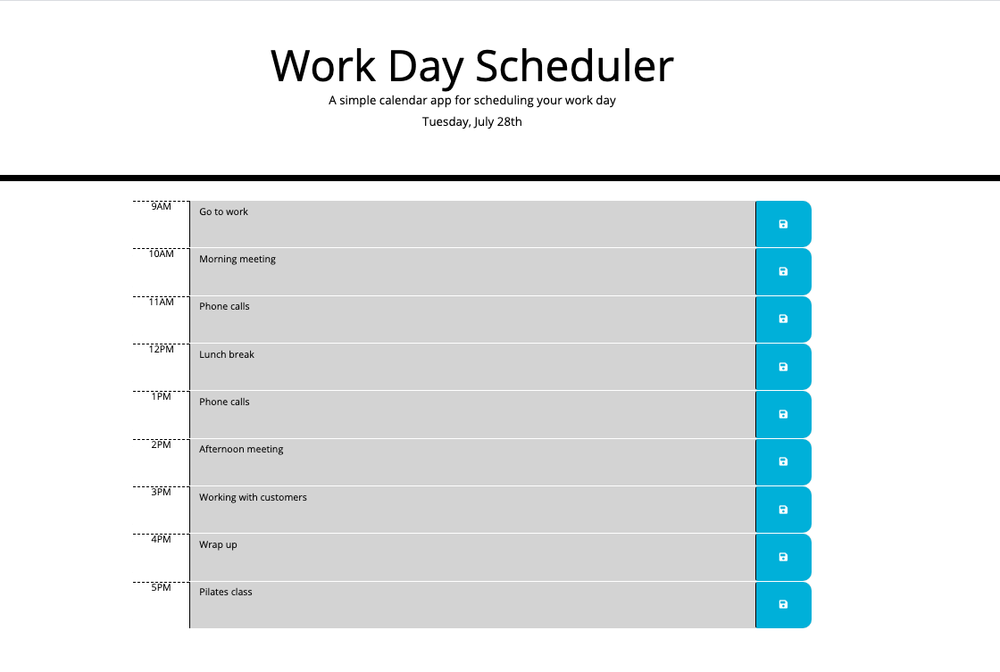

# daily-planner
Homework 5: Work Day Planner

## Summary
Implementing a major productivity hack is much simpler than it seems. Some days life can get so busy, it leaves you wondering where the day really went. To make sure you're making the most of your day, try incorporating a daily planner into your everyday routine! 

Most people track birthdays, dentist appointments, vet visits, and other important dates on monthly calendars. This can help people ensure they do not miss any important dates, but it doesn't really help you make the most of a particular day. That is where this Daily Planner comes in.

Daily Planner is a simple calendar app for scheduling your normal work day. Blocking out your day hour by hour can really ensure you tackle your to-do list. Scheduling time for each task can prepare you to use your time efficiently and address things you might not usually get to. Daily Planner contains all of these great features to help you seize the day professionally and personally:

- current day is displayed at the top of the calendar
- timeblocks align with standard business hours
- website focuses on ONE day at a time
- each timeblock is color coded to indicate whether it is in the past, present, or future
- user can enter a task into each timeblock with descriptions
- the save button for each timeblock ensures each task remains even after refreshing the page

Link:

## Site Picture 

## Built With
* [jQuery](https://api.jquery.com/)
* [HTML](https://developer.mozilla.org/en-US/docs/Web/HTML)
* [CSS](https://developer.mozilla.org/en-US/docs/Web/CSS)
* [Boostrap](https://getbootstrap.com/)
